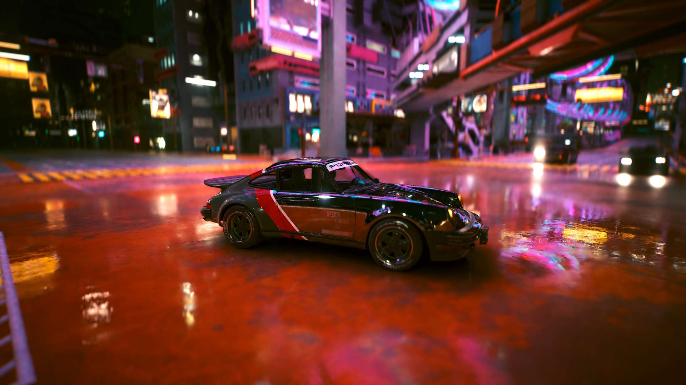
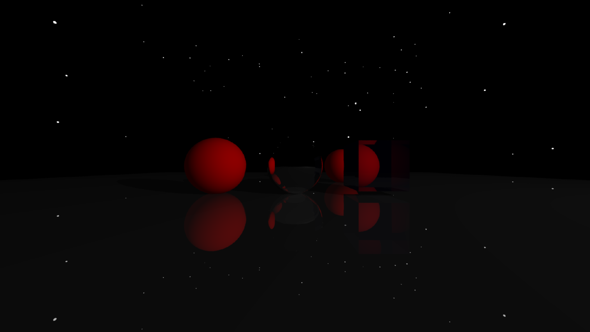
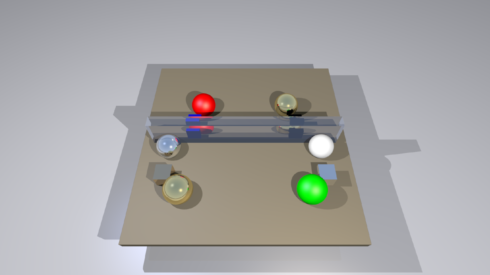

# Raytracer CPU et GPU (CUDA)

Ce projet est un moteur de rendu par lancer de rayons (Raytracing) développé pour comparer les performances entre une exécution séquentielle sur CPU et une exécution parallèle sur GPU via l'architecture CUDA.

## Architecture du Projet

Le projet est organisé en plusieurs répertoires pour séparer les implémentations et les tests :

* **/CPU** : Contient le code source de la version séquentielle (C++17). Cette version utilise le polymorphisme classique pour la gestion des objets.
* **/GPU** : Contient le code source de la version parallèle (CUDA). L'architecture a été aplatie pour supprimer les fonctions virtuelles et optimiser le débit de calcul.
* **/Objet** : Regroupe les classes et structures communes (Vec3D, Rayon3D, Objet3D) utilisées par les deux versions grâce aux qualificateurs __host__ et __device__.

## Fonctionnalités

* Calcul d'intersections pour sphères et cubes.
* Gestion des matériaux : Diffus, Miroir (Réflexion) et Diélectrique (Réfraction).
* Antialiasing (MSAA) par multi-échantillonnage.
* Système de benchmark intégré pour mesurer le débit de rayons par seconde.

## Prérequis

Pour compiler et exécuter ce projet, l'environnement suivant est nécessaire :

* **Système** : Windows 10 ou 11.
* **Outils de build** : MinGW (pour mingw32-make) et Visual Studio 2022 avec les outils de développement C++.
* **GPU** : Une carte graphique NVIDIA compatible CUDA.
* **Logiciels** : NVIDIA CUDA Toolkit (version 12.x recommandée).

## Compilation et Exécution

La compilation s'effectue via le terminal "Native Tools Command Prompt for VS 2022" afin de garantir l'accès au compilateur `nvcc`.

1. Accédez au répertoire souhaité (CPU ou GPU) :
   cd CPU
   ou
   cd GPU

2. Compilez et lancez les tests/benchmarks avec la commande :
   mingw32-make test

Cette commande génère l'exécutable, lance la validation des tests unitaires et affiche les performances du moteur.

## Rendus

**Image CPU**

**Image GPU**

---
**Auteur** : Nathaniel - Master CHPS (M1)